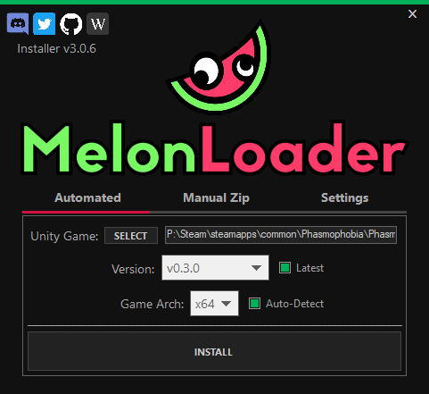
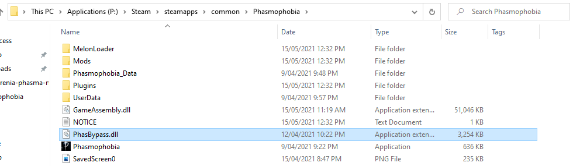

# Bitzophrenia Phasmophobia Mod

Bitzophrenia is a mod designed to give Twitch streamers the ability to integrate chat commands and cheer rewards into Phasmophobia.

----------

## Installing MelonLoader

1. ...
2. ...
3. Select the Phasmaphobia.exe file from your Stream installation directory and click `Install`.

    

## Installing PhasByPass
In order to be able to run our Mod, we'll need to install the PhasBypass DLL.

1. Download the relevant version from GitHub: https://github.com/LelouBil/PhasBypass/releases
2. Copy the DLL file into your Phasmaphobia Steam directory/

    

At this point, it would be a good idea to test your setup by starting Phasmaphobia and playing a quick round. This will give you a good indication of whether MelonLoader and the PhasBypass.dll are working correctly, as they tend to break easily with each new release.

## Builing the Bitzophrenia Mod

